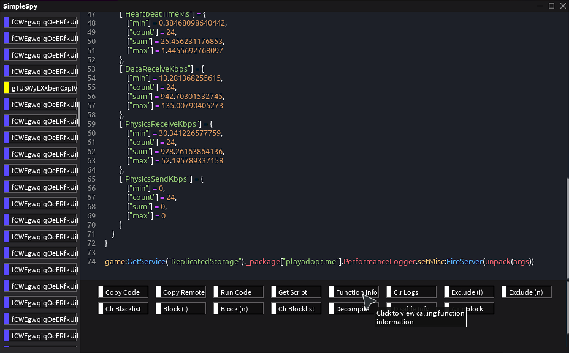
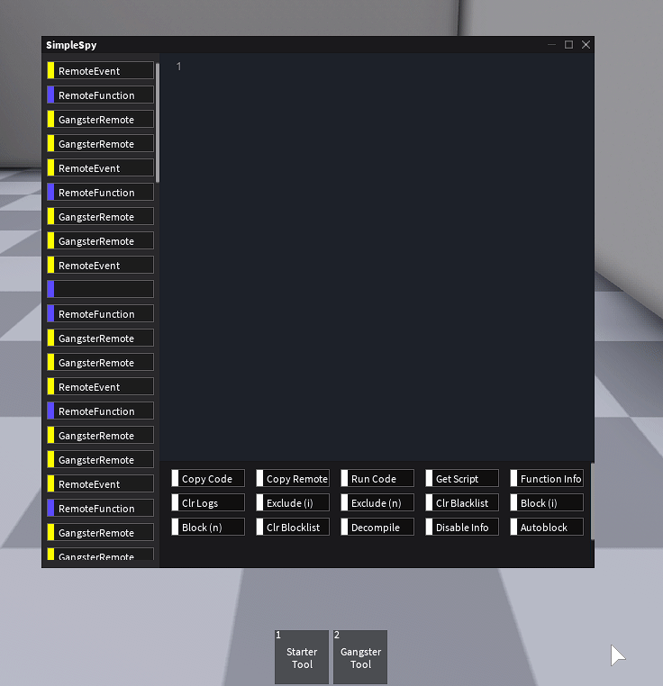

# SimpleSpy


SimpleSpy is a penetration testing tool designed to intercept [remote calls](https://developer.roblox.com/en-us/articles/Remote-Functions-and-Events) from the client to the server.

SimpleSpy is designed to be the "default" remote spy and built with minimal bloat, performance, and reliability in mind. You can find SimpleSpy in places such as [Infinite Yield](https://github.com/EdgeIY/infiniteyield), [CMD X](https://github.com/CMD-X/CMD-X), and more.
## Features


- Simple user interface
- Continuous support
- Included Remote-to-Script for arguments
- Improved stability and performance over alternatives
## Usage
To use SimpleSpy, just run the following code (or copy the code from SimplySpy.lua) in a supported executor.
```lua
loadstring(game:HttpGet("https://github.com/exxtremestuffs/SimpleSpySource/raw/master/SimpleSpy.lua"))()
```
## API
https://youtu.be/BBnf18N1mYM

SimpleSpy provides a few handy API functions show below...
```lua
-- This is designed to convert any value into a variable, with the 2nd argument being the (optional) name of the variable.
SimpleSpy:ValueToVar(value: any, name: string | nil): string
-- This is designed to convert each individual index of a table of values into variables, with the (optional) index being the variable name.
SimpleSpy:TableToVars(t: table): string
-- This method can be used to quickly generate a string from a given value. This isn't recommended to be used with tables (though it does support them), since this will not generate the value as a variable.
SimpleSpy:ValueToString(value: any): string
-- This method is designed largely for internal use, but it can be used to generate SimpleSpy's iconic R2S scripts.
SimpleSpy:ArgsToString(method: string, args: table): string
-- This is used internally to generate a table of function info (basically debug.getinfo and debug.getconstants). Might be handy to use w/ getgc().
SimpleSpy:GetFunctionInfo(f: function): string
-- This will directly hook any remote calls, you must return arguments as a table.
SimpleSpy:HookRemote(remote: RemoteFunction | RemoteEvent, callback: (...args: unknown[]) => void): nil
-- This will return a (functionally equivalent) ScriptSignal you can connect to remote calls with. See Roblox documentation for more info.
SimpleSpy:GetRemoteFiredSignal(remote: RemoteFunction | RemoteEvent): ScriptSignal
-- Prevents the specified remote from firing.
SimpleSpy:BlockRemote(remote: RemoteEvent | RemoteFunction | string): nil
-- Excludes the specified remote from logs
SimpleSpy:ExcludeRemote(remote: RemoteEvent | RemoteFunction | string): nil
```